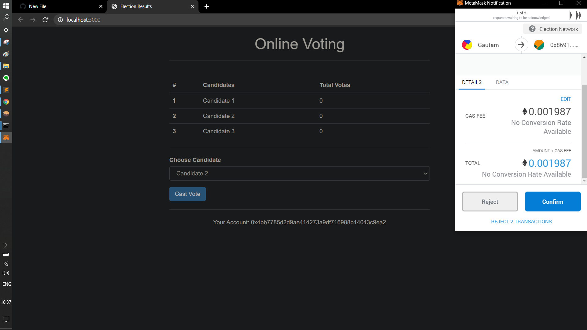

## OnlinePolling_Blockchain
Smart contract is written in Solidity to guide the rules of voting. Blockchain is simulated as ganache framework.

## Step 1.Install Dependencies
- NPM: https://nodejs.org
- Truffle: https://github.com/trufflesuite/truffle
- Ganache: http://truffleframework.com/ganache/
- Metamask: https://metamask.io/

## Step 2. Start Ganache
Open the Ganache GUI client that you downloaded and installed. This will start your local blockchain instance. See free video tutorial for full explanation.

## Step 3. Compile & Deploy Election Smart Contract
`$ truffle migrate --reset`
Do this each time after restaring ganache.

## Step 4. Run the Front End Application
`$ npm run dev`

