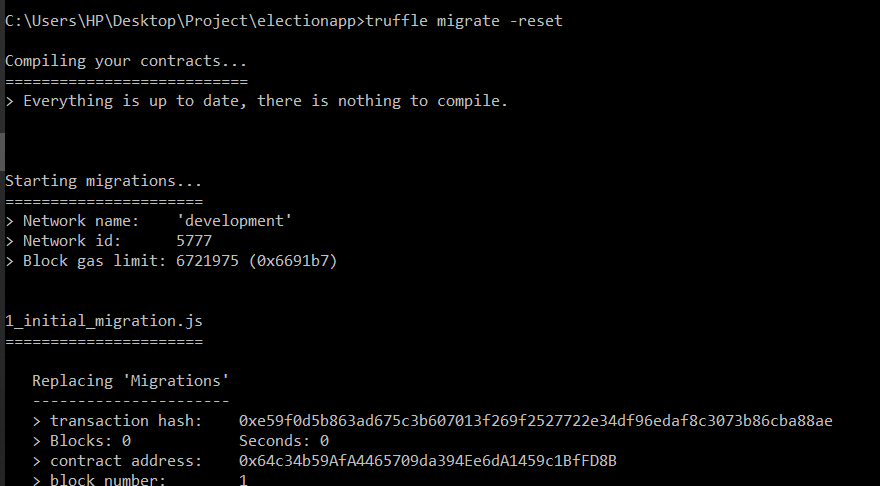
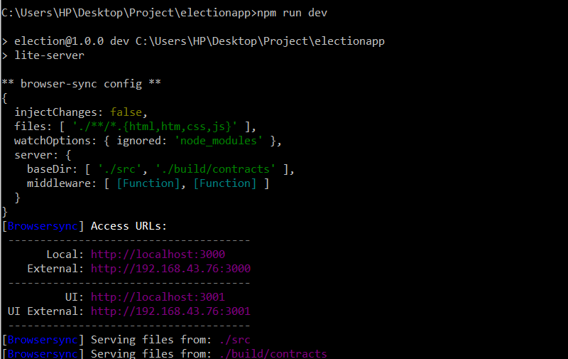

### OnlinePolling_Blockchain
Smart contract is written in Solidity to guide the rules of voting. Blockchain is simulated as ganache framework.

### Dependencies
- NPM: https://nodejs.org
- Ganache: http://truffleframework.com/ganache/
- Truffle: https://github.com/trufflesuite/truffle
- Metamask: https://metamask.io/

### Run Ganache
It simulates local blockchain instance.

### Compile & Deploy Smart Contract
`$ truffle migrate --reset`
 

### Running Front End
`$ npm run dev`

 

